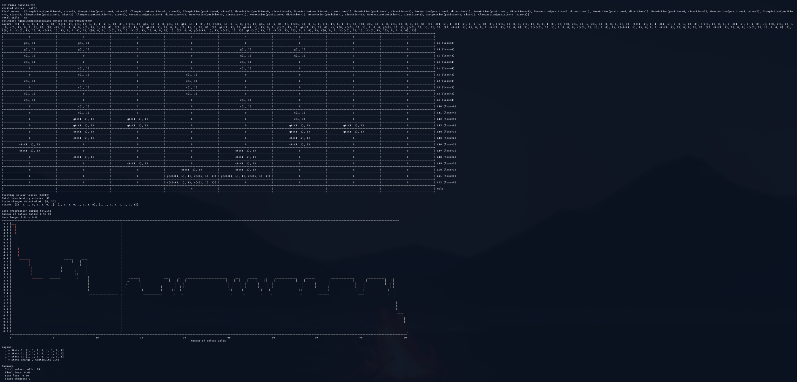
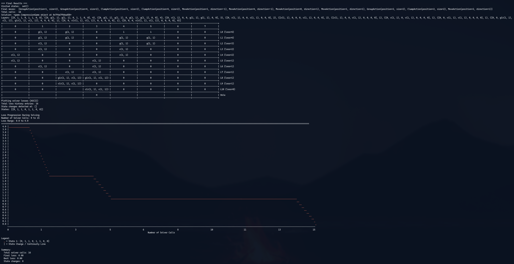
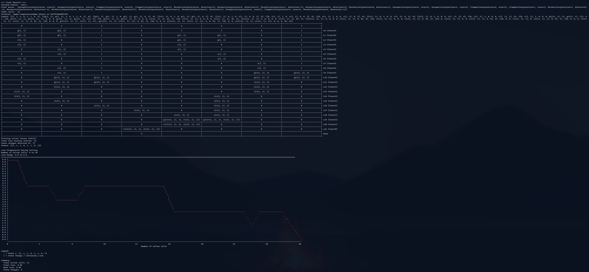
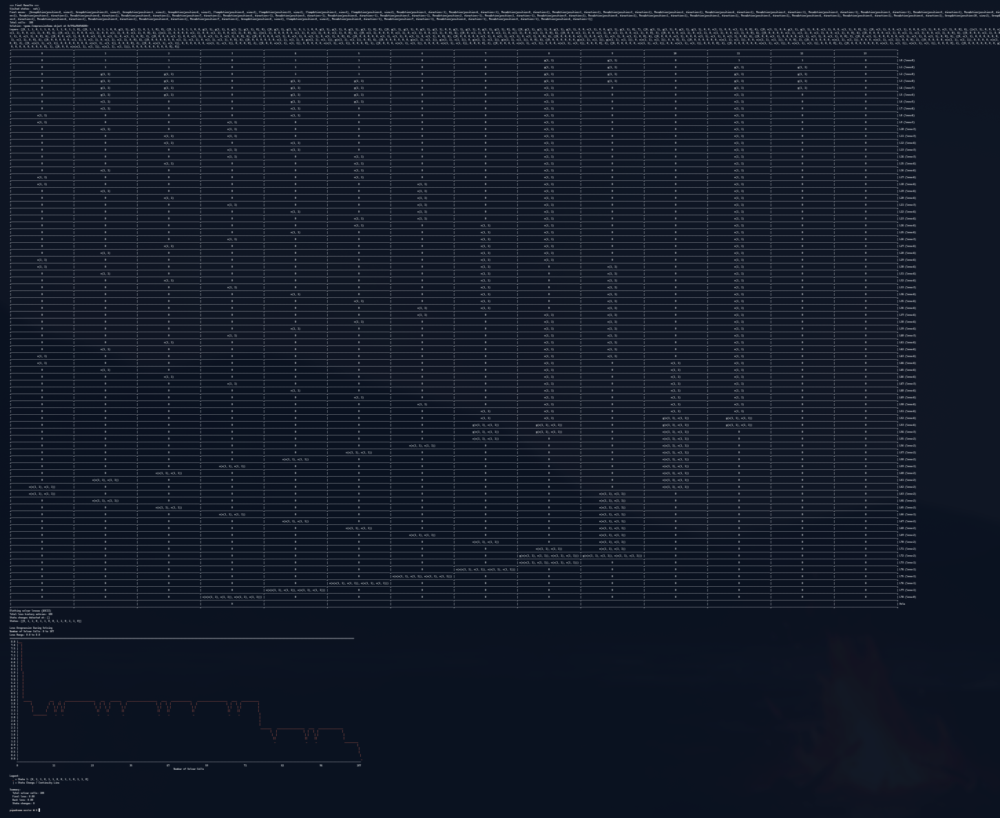
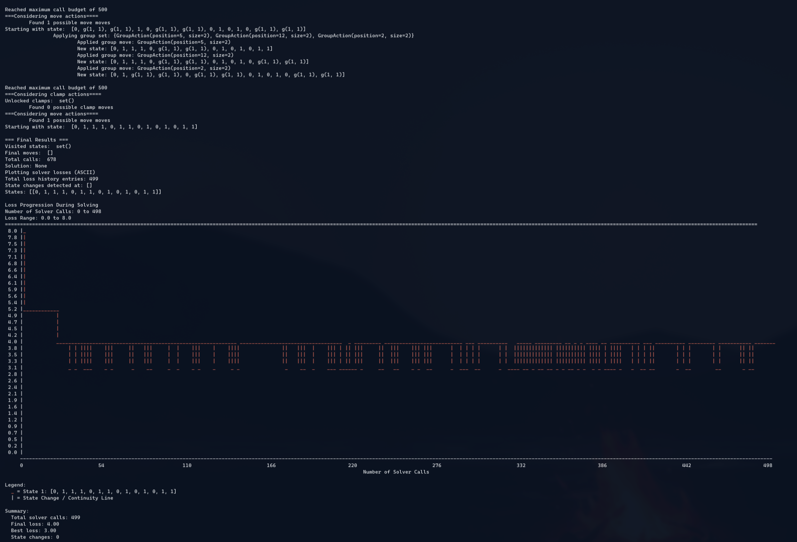

# Pipedream : Compression Game

Pipedream is an extremely hackable text-based compression game where the core goal is write an automated solver script that can solve arbitrary levels of the game in the fewest number of steps.



## Game Concept : 

The initial state of the game is a 'leaky roof' - a single array that looks like : ["1,1,1,0,0,1,1,0,1"]. The 1s are the holes, each of which is dripping water down to the ground, one drop for every step of the game. In this case there are six 1s, so six holes strewn around the roof, so at this state, 6 drops of water are getting lost at every step of the game. 

There's a bucket on the floor that can be used collect this water and stem this loss. If we had only 1 (hole) at position 7 in the roof state array, and the bucket was also at position 7, then there would be no water loss and the game would be 'solved'. But for the non-trivial case, the way to do this is to reduce N holes to 1 hole as quickly as possible - by creating a (inverted) pyramid of pipes from the roof to the bucket on the floor. Similar groupings of narrow pipes can be combined into a single (higher order) pipe that can be moved around to create even higher order pipes. In each step of the game, you can either move a pipe left or right or group pipes in similar sequences together  'grouping pattern' reduces the 'rate of loss' by however many pipes it combines into a higher pipe. (for example, for initial state [1,1,1,0,0,1,1,0,1] it would make sense to make the grouping `[1, (1,1), 0, 0, (1, 1), 0,1]`. This unlocks a higher order pipe of type `(1,1)` that can reduce 2 hole leak to a 1 hole leak, reducing 'rate of loss' from 6 drops/step to 4 drops/step.

The goal of the game is to bring down the 'rate of loss' to 0 - by basically constructing a single higher-order pipe that is located right over the bucket location in the fewer number of steps. The feedback (to the player, scripted or otherwise), is the 'rate of loss' at each step. Here's an example of this 'gameplay' where you see how each step gradually stems the rate of loss :




## Usage 

You can run a game with a random initial state and bucket position:

```
uv run game.py 
```


or initialize the game state like this to play it:

```
uv run game.py --state "1,1,1,0,0,1,1,0,1" --bucket 3
```


The `--state` argument takes a comma-separated string of 1s and 0s representing the initial state of the roof.
The `--bucket` argument specifies which position should be treated as the hole (0-based index).


Basic controls : 

1. The game state consists of a sequence of 1s and 0s, with one position designated as a "bucket"
2. You can perform these actions:
   - Group consecutive identical elements
   - Clamp groups (once you've seen the same group pattern twice)
   - Move clamps into adjacent holes
3. The goal is to minimize the number of non-zero elements (excluding the hole position) i.e. build up the one single higher-order pipe 


## Gameplay

During interactive play, you can:
- Choose actions by entering numbers 0-4
- View the current state and available moves
- See unlocked clamp patterns
- View the history of moves in layer view
- Save game progress automatically on exit

Games are automatically saved to timestamped directories under `gameplays/` for later replay.

Replay a previously saved game:

```
uv run game.py --replay gameplays/game_20250204_184018
```

Playing manually gets slow and tedious quickly, so the ideal way to play is to write a solver for the game. 

A basic solver that does depth-first search is given as a demonstration in `dfs_solver.py`. It is highly suboptimal, but can be used to test out the base difficulty/complexity of different initial states of the game. Check Appendix (later in the document) for a rundown of how it works and extend the base class `solver.py` to try out your own.

Test it out : 

IMPORTANT NOTE : It's best to keep your terminal in full-screen mode and zoom out using Ctrl - to visualize results best.

```
uv run dfs_solver.py 1-easy

# state_changes = [
   ([0, 1, 1, 0, 1, 1, 0, 0], 0),  # Initial state
]
# bucket_idx = 3
# desired_loss = 0 -->
```

Easy initial state, solves in 10 steps.


```
uv run dfs_solver.py 1-medium 
```


Medium difficulty. solves in 21 steps. 
```
uv run dfs_solver.py 1-hard 
```
Hard to find patterns, takes 78 steps to solve. Stagnates a few times but eventually converges to a single pipe. Interesting because it zigzags aimlessly for a lot of steps finding all sorts of common groupings until the 'aha' moment strikes at step 72.



```
uv run dfs_solver.py 1-unsolvable
```
An example of an initial state that is unsolvable with the current constraints. 

Exercise to reader : try to see flipping which value in the array makes it solvable again



```
uv run dfs_solver.py 3-easy

# state_changes = [
#   ([1, 1, 1, 0, 1, 1, 0, 1], 0),  # Initial state
#   ([1, 1, 1, 0, 1, 1, 1, 0], 0.8),  # First change after 0.8 seconds
#   ([1, 1, 1, 0, 1, 1, 1, 1], 2.5),  # Second change after 2.5 seconds
# ]

# bucket_idx = 3
# desired_loss = 0
```

This shows how the DFS solver adapts to changes in the initial state over a period of 3 seconds. Not how at each state transition, the rate of water loss goes up slightly and then comes down (the solver is adapting to 'uncertainty')


### Appendix 

How the DFS solver demonstration in `dfs_solver.py` works : 

It uses recursive depth-first search to find solutions by trying different action sequences:

1. Action Types: It considers three types of actions in order:
 • Group actions : Find repeating patterns (2-4 elements) and group them
 • Clamp actions : Clamp groups that match unlocked patterns
 • Move actions : Move clamps into adjacent holes
2. Search Strategy: For each game state, it:
 • Finds all possible actions of each type
 • Groups compatible actions that don't conflict
 • Recursively tries each action combination
 • Returns the first solution found


## Key Functions

• find_possible_groups() : Identifies repeating patterns that can be grouped
• find_possible_clamps() : Finds groups that can be clamped based on unlocked patterns
• find_possible_moves() : Identifies clamps that can move into adjacent holes

## State Management

The solver tracks:

• Visited states : Prevents revisiting the same game state
• Call limits : Stops after max_calls to prevent infinite search
• Loss tracking : Records game losses for analysis

## Dynamic State Changes

The solver handles changing initial states during search (dfs_solver.py:278-341):

• Detects when the global game state changes
• Can preserve valid moves or restart fresh
• Continues search from the new state


(P.S. this project has no dependencies and intends to remain as barebones as possible. You can include an optional `matplotlib` if you want an alternative to the default ASCII plotter)

### LICENSE

MIT


